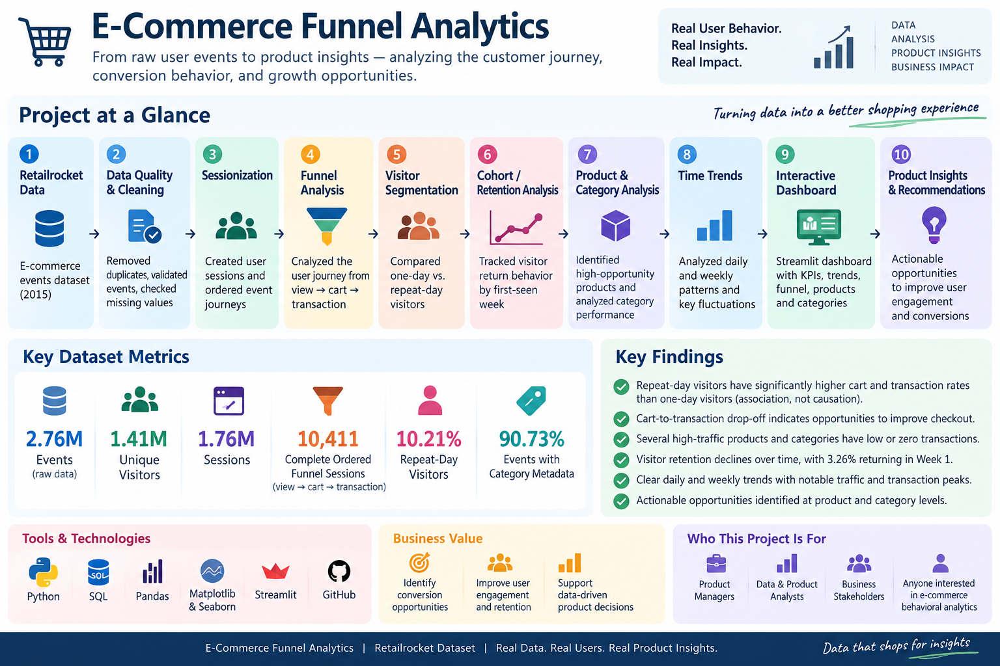

# E-Commerce Funnel Analytics

An exploratory product analytics project using Retailrocket behavioral data to understand customer journeys, funnel drop-off, repeat behavior, product/category opportunities, and retention patterns.

## Project at a glance



The analysis moves from raw event data through cleaning, sessionization, funnel analysis, visitor segmentation, cohorts, product/category analysis, SQL workflows, and an interactive Streamlit dashboard.

## Questions explored

- How many visitors reach view, cart, and transaction stages?
- Where does the ordered session journey lose users?
- Which products and categories receive traffic without downstream activity?
- How does behavior differ between one-day and repeat-day visitors?
- How quickly does weekly visitor recurrence decline?
- How does behavioral activity change over time?

## Key findings

- **2,755,641** clean events after removing 460 exact duplicates.
- **1,407,580** unique visitors and **235,061** unique products.
- A 30-minute inactivity rule produces **1,761,675** sessions.
- **35,832** sessions contain ordered view → cart activity and **10,411** contain ordered view → cart → transaction activity.
- **279 of 996** high-traffic products in the opportunity screen record zero transaction events despite **107,352** views.
- Repeat-day visitors are **10.21%** of visitors and show a **3.50%** observed transaction-visitor rate versus **0.53%** for one-day visitors.
- Weighted first-seen cohort recurrence is **3.26% at week 1** and **0.95% at week 4**.
- Category metadata covers **90.73%** of clean behavioral events and **1,086** represented categories.
- Among categories with at least 1,000 views, **12** record no transaction events.

These are descriptive analytical signals. They should not be interpreted as causal effects.

## Analysis workflow

1. Validate and clean event data.
2. Parse timestamps and remove exact duplicates.
3. Sessionize behavior using a 30-minute inactivity threshold.
4. Compare observed visitor stages with ordered session journeys.
5. Analyze one-day and repeat-day visitor behavior.
6. Build weekly first-seen retention cohorts.
7. Screen product-level traffic and downstream activity.
8. Enrich products with category metadata and category hierarchy.
9. Analyze daily and weekly trends.
10. Surface findings in reports and the Streamlit dashboard.

## Tools

Python, Pandas, NumPy, SQL, DuckDB, Matplotlib, Streamlit, and Pytest.

## Repository structure

- `data/` — dataset documentation and local-data instructions
- `sql/` — reproducible funnel, session, trend, visitor, and product queries
- `src/` — reusable analysis modules
- `dashboard/` — Streamlit dashboard
- `reports/` — findings, interpretation, and recommendations
- `tests/` — checks for core analytical logic

## Data

The project uses the public **Retailrocket E-Commerce Dataset**. Raw source files are intentionally excluded from Git because of their size.

For the full analysis, place these files in `data/raw/`:

```text
events.csv
item_properties_part1.csv
item_properties_part2.csv
category_tree.csv
```

See `data/README.md` for details.

## Run locally

```bash
pip install -r requirements.txt
python -m src.analysis
streamlit run dashboard/app.py
```

Run tests with:

```bash
pytest
```

## Reports

- `reports/initial_findings.md` — source profile and observed funnel
- `reports/sessionized_funnel.md` — ordered session journey
- `reports/product_opportunities.md` — product opportunity screen
- `reports/visitor_and_time_trends.md` — repeat behavior and temporal trends
- `reports/cohort_and_data_quality.md` — cohort recurrence and quality checks
- `reports/category_analysis.md` — category and hierarchy findings
- `reports/business_recommendations.md` — product questions and recommended follow-ups
- `reports/analysis_notes.md` — assumptions and interpretation guardrails

## Interpretation notes

A transaction event is the dataset's downstream purchase signal. Sessions are inferred rather than supplied by the source. Aggregate event ratios are useful screening metrics but are not causal conversion estimates. Category IDs are anonymized and cannot be assigned real-world merchandise labels from the supplied data alone.

## Status

The core analysis is complete: data quality, observed and ordered funnels, sessionization, product opportunities, repeat-visitor behavior, cohorts, time trends, category enrichment, dashboarding, recommendations, and automated analytical checks are all represented in the repository.
